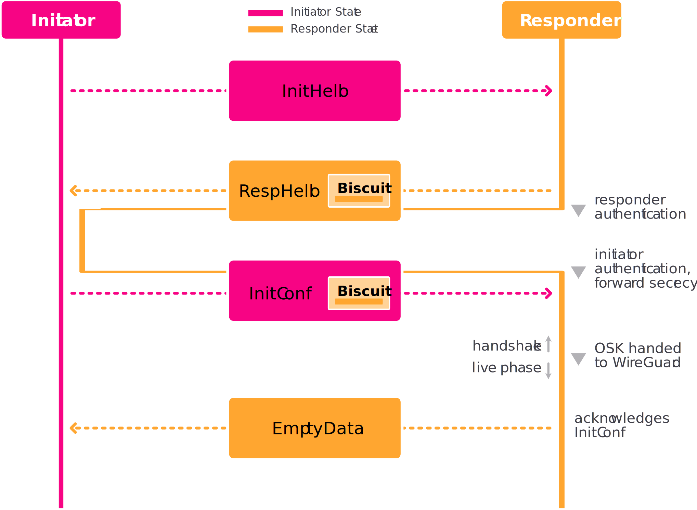
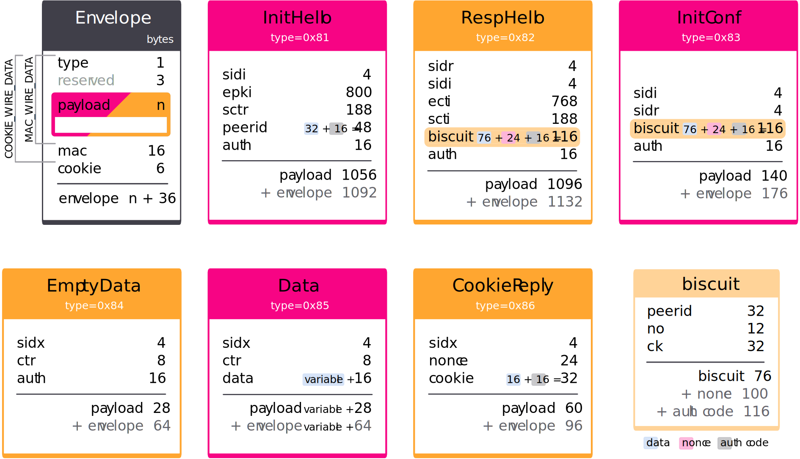
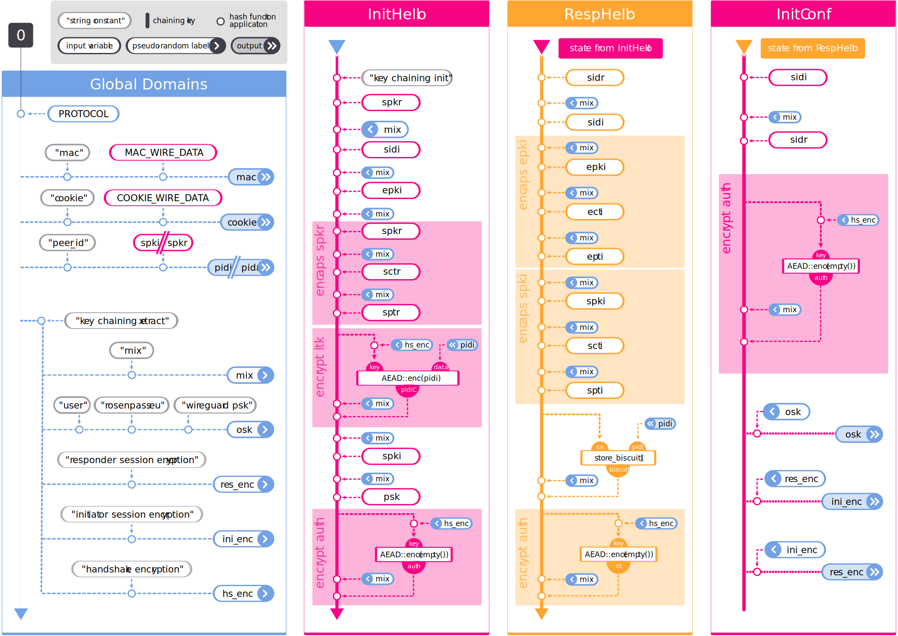
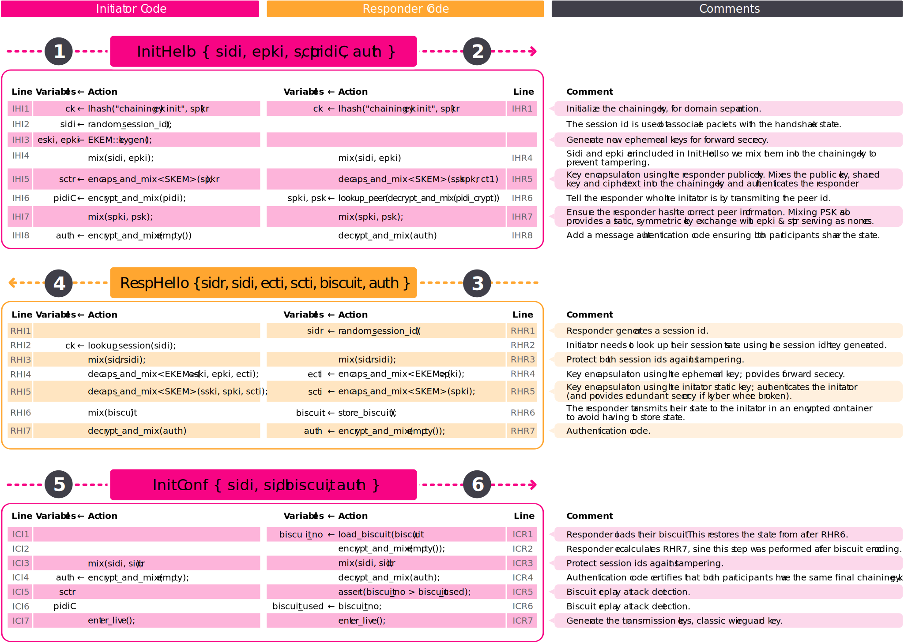

\enlargethispage{5mm}
\setupimage{label=img:KeyExchangeProt,width=.9\linewidth}


\setupimage{label=img:MessageTypes}


\clearpage

\addtocontents{toc}{\string\setcounter{tocdepth}{\string\sectionnumdepth}}
\setcounter{secnumdepth}{\sectionnumdepth}

# Security

Rosenpass inherits most security properties from Post-Quantum WireGuard (PQWG). The security properties mentioned here are covered by the symbolic analysis in the Rosenpass repository. 

## Secrecy
Three key encapsulations using the keypairs `sski`/`spki`, `sskr`/`spkr`, and `eski`/`epki` provide secrecy (see Section \ref{variables} for an introduction of the variables). Their respective ciphertexts are called `scti`, `sctr`, and `ectr` and the resulting keys are called `spti`, `sptr`, `epti`. A single secure encapsulation is sufficient to provide secrecy. We use two different KEMs (Key Encapsulation Mechanisms; see Section \ref{skem}): Kyber and Classic McEliece.

## Authenticity

The key encapsulation using the keypair `sskr`/`spkr` authenticates the responder from the perspective of the initiator. The KEM encapsulation `sski`/`spki` authenticates the initiator from the perspective of the responder. Authenticity is based on the security of Classic McEliece alone.

## Secrecy and Authenticity based on a Pre-Shared Symmetric Key

We allow the use of a pre-shared key (`psk`) as protocol input. Even if all asymmetric security primitives turn out to be insecure, providing a secure `psk` will have Rosenpass authenticate both peers, and output a secure shared key.

## Forward Secrecy

Forward secrecy refers to secrecy of past sessions in case all static keys are leaked. Imagine an attacker recording the network messages sent between two devices, developing an interest in some particular exchange,  and stealing both computers in an attempt to decrypt that conversation. By stealing the hardware, the attacker gains access to `sski`, `sskr`, and the symmetric secret `psk`. Since the ephemeral keypair `eski`/`epki` is generated on the fly and deleted after the execution of the protocol, it cannot be recovered by stealing the devices, and thus, Rosenpass provides forward secrecy. Forward secrecy relies on the security of Kyber and on proper zeroization, i.e., the implementation must erase all temporary variables.

## Security against State Disruption Attacks {#statedis}

Both WG and PQWG are vulnerable to state disruption attacks; they rely on a timestamp to protect against replay of the first protocol message. An attacker who can tamper with the local time of the protocol initiator can inhibit future handshakes [@statedis], rendering the initiator’s static keypair practically useless. Due to the use of the insecure NTP protocol, real-world deployments are vulnerable to this attack [@statedis_cve]. Lacking a reliable way to detect retransmission, we remove the replay protection mechanism and store the responder state in an encrypted cookie called “the biscuit” instead. Since the responder does not store any session-dependent state until the initiator is interactively authenticated, there is no state to disrupt in an attack.

Note that while Rosenpass is secure against state disruption, using it does not protect WireGuard against the attack. Therefore, the hybrid Rosenpass/WireGuard setup recommended for deployment is still vulnerable.

\addtocontents{toc}{\string\setcounter{tocdepth}{\string\subsectionnumdepth}}
\setcounter{secnumdepth}{\subsubsectionnumdepth}

# Protocol Description

## Cryptographic Building Blocks

All symmetric keys and hash values used in Rosenpass are 32 bytes long.


### Hash {#hash}

A keyed hash function with one 32-byte input, one variable-size input, and one 32-byte output. As keyed hash function we offer two options that can be configured on a peer-basis, with Blake2s being the default:

1. the HMAC construction [@rfc_hmac] with BLAKE2s [@rfc_blake2] as the inner hash function.
2. the SHAKE256 extendable output function (XOF) [@SHAKE256] truncated to a 32-byte output. The result is produced be concatenating the 32-byte input with the variable-size input in this order.

```pseudorust
hash(key, data) -> key
```

### AEAD

Authenticated encryption with additional data for use with sequential nonces. We use ChaCha20Poly1305 [@rfc_chachapoly] in the implementation.

```pseudorust
AEAD::enc(key, nonce, plaintext, additional_data) -> ciphertext
AEAD::dec(key, nonce, ciphertext, additional_data) -> plaintext
```

### XAEAD

Authenticated encryption with additional data for use with random nonces. We use XChaCha20Poly1305 [@draft_xchachapoly] in the implementation, a construction also used by WireGuard.


```pseudorust
XAEAD::enc(key, nonce, plaintext, additional_data) -> ciphertext
XAEAD::dec(key, nonce, ciphertext, additional_data) -> plaintext
```

### SKEM {#skem}

“Key Encapsulation Mechanism” (KEM) is the name of an interface widely used in post-quantum-secure protocols. KEMs can be seen as asymmetric encryption specifically for symmetric keys. Rosenpass uses two different KEMs. SKEM is the key encapsulation mechanism used with the static keypairs in Rosenpass. The public keys of these keypairs are not transmitted over the wire during the protocol. We use Classic McEliece 460896 [@mceliece] which claims to be as hard to break as 192-bit AES. As one of the oldest post-quantum-secure KEMs, it enjoys wide trust among cryptographers, but it has not been chosen for standardization by NIST. Its ciphertexts and private keys are small (188 bytes and 13568 bytes), and its public keys are large (524160 bytes). This fits our use case: public keys are exchanged out-of-band, and only the small ciphertexts have to be transmitted during the handshake.

```pseudorust
SKEM::enc(public_key) -> (ciphertext, shared_key)
SKEM::dec(secret_key, ciphertext) -> shared_key
```

### EKEM

Key encapsulation mechanism used with the ephemeral KEM keypairs in Rosenpass. The public keys of these keypairs need to be transmitted over the wire during the protocol. We use Kyber-512 [@kyber], which has been selected in the NIST post-quantum cryptography competition and claims to be as hard to break as 128-bit AES. Its ciphertexts, public keys, and private keys are 768, 800, and 1632 bytes long, respectively, providing a good balance for our use case as both a public key and a ciphertext have to be transmitted during the handshake.

```pseudorust
EKEM::enc(public_key) -> (ciphertext, shared_key)
EKEM::dec(secret_key, ciphertext) -> shared_key
```

Using a combination of two KEMs – Classic McEliece for static keys and Kyber for ephemeral keys – results in large static public keys, but allows us to fit all network messages into a single IPv6 frame.

Rosenpass uses libsodium [@libsodium] as cryptographic backend for hash, AEAD, and XAEAD, and liboqs [@liboqs] for the post-quantum-secure KEMs.

## Variables {#variables}

### KEM Keypairs and Ciphertexts

Rosenpass uses multiple keypairs, ciphertexts, and plaintexts for key encapsulation: a static keypair for each peer, and an ephemeral keypair on the initiator's side. We use a common naming scheme to refer to these variables:

\begin{namepartpicture}
\namepart{s=Static,e=Ephemeral}
\namepart[3.5cm]{sk=Secret Key,pk=Public Key,pt=Plaintext,ct=Ciphertext}
\namepart[7cm]{i=Initiator,r=Responder,m=Mine,t=Theirs}
\begin{scope}[decoration={brace,amplitude=5mm},thick]
\namebraceright{s}{e}
\namebraceleft{sk}{ct}
\namebraceright{sk}{ct}
\namebraceleft{i}{t}
\end{scope}
\end{namepartpicture}

These values use a naming scheme consisting of four lower-case characters. The first character indicates whether the key is static `s` or ephemeral `e`. The second character is an `s` or a `p` for secret or public. The third character is always a `k`. The fourth and final character is an `i`, `r`, `m`, or `t`, for `initiator`, `responder`, `mine`, or `theirs`. The initiator's static public key for instance is `spki`. During execution of the protocol, three KEM ciphertexts are produced: `scti`, `sctr`, and `ecti`.

Besides the initiator and responder roles, we define the roles `mine` and `theirs` (`m`/`t`). These are sometimes used in the code when the assignment to initiator or responder roles is flexible. As an example, “this server's” static secret key is `sskm`, and the peer's public key is `spkt`.


### IDs

Rosenpass uses two types of ID variables. See Figure \ref{img:HashingTree} for how the IDs are calculated.

\begin{namepartpicture}
\namepart{sid=Session ID, pid=Peer ID}
\namepart[3.5cm]{i=Initiator,r=Responder,m=Mine,t=Theirs}
\begin{scope}[decoration={brace,amplitude=5mm},thick]
\namebraceright{sid}{pid}
\namebraceleft{i}{t}
\end{scope}
\end{namepartpicture}

The first lower-case character indicates whether the variable is a session ID (`sid`) or a peer ID (`pid`). The final character indicates the role using the characters `i`, `r`, `m`, or `t`, for `initiator`, `responder`, `mine`, or `theirs` respectively.

### Symmetric Keys

Rosenpass uses two symmetric key variables `psk` and `osk` in its interface, and maintains the entire handshake state in a variable called the chaining key.


* `psk`: A pre-shared key that can be optionally supplied as input to Rosenpass.
* `osk`: The output shared key, generated by Rosenpass and supplied to WireGuard for use as its pre-shared key.
* `ck`: The chaining key.

We mix all key material (e.g. `psk`) into the chaining key, and derive symmetric keys such as `osk` from it. We authenticate public values by mixing them into the chaining key; in particular, we include the entire protocol transcript in the chaining key, i.e., all values transmitted over the network.

## Hashes

Rosenpass uses a cryptographic hash function for multiple purposes:

* Computing the message authentication code in the message envelope as in WireGuard
* Computing the cookie to guard against denial of service attacks. This is a feature adopted from WireGuard, but not yet included in the implementation of Rosenpass.
* Computing the peer ID
* Key derivation during and after the handshake
* Computing the additional data for the biscuit encryption, to provide some privacy for its contents

Recall from Section \ref{hash} that rosenpass supports using either BLAKE2s or SHAKE256 as hash function, which can be configured for each peer ID. However, as noted above, rosenpass uses a hash function to compute the peer ID and thus also to access the configuration for a peer ID. This is an issue when receiving an `InitHello`-message, because the correct hash function is not known when a responder receives this message and at the same the responders needs it in order to compute the peer ID and by that also identfy the hash function for that peer. The reference implementation resolves this issue by first trying to derive the peer ID using SHAKE256. If that does not work (i.e. leads to an AEAD decryption error), the reference implementation tries again with BLAKE2s. The reference implementation verifies that the hash function matches the one confgured for the peer. Similarly, if the correct peer ID is not cached when receiving an InitConf message, the reference implementation proceeds in the same manner.

Using one hash function for multiple purposes can cause real-world security issues and even key recovery attacks [@oraclecloning]. We choose a tree-based domain separation scheme based on a keyed hash function – the previously introduced primitive `hash` – to make sure all our hash function calls can be seen as distinct.

\setupimage{landscape,fullpage,label=img:HashingTree}


Each tree node $\circ{}$ in Figure 3 represents the application of the keyed hash function, using the previous chaining key value as first parameter. The root of the tree is the zero key. In level one, the `PROTOCOL` identifier is applied to the zero key to generate a label unique across cryptographic protocols (unless the same label is deliberately used elsewhere). In level two, purpose identifiers are applied to the protocol label to generate labels to use with each separate hash function application within the Rosenpass protocol. The following layers contain the inputs used in each separate usage of the hash function: Beneath the identifiers `"mac"`, `"cookie"`, `"peer id"`, and `"biscuit additional data"` are hash functions or message authentication codes with a small number of inputs. The second, third, and fourth column in Figure 3 cover the long sequential branch beneath the identifier `"chaining key init"` representing the entire protocol execution, one column for each message processed during the handshake. The leaves beneath `"chaining key extract"` in the left column represent pseudo-random labels for use when extracting values from the chaining key during the protocol execution. These values such as `mix >` appear as outputs in the left column, and then as inputs `< mix` in the other three columns.

The protocol identifier depends on the hash function used with the respective peer is defined as follows if BLAKE2s [@rfc_blake2] is used:

```pseudorust
PROTOCOL = "rosenpass 1 rosenpass.eu aead=chachapoly1305 hash=blake2s ekem=kyber512 skem=mceliece460896 xaead=xchachapoly1305"
```

If SHAKE256 [@SHAKE256] is used, `blake2s` is replaced by `shake256` in `PROTOCOL`. Since every tree node represents a sequence of `hash` calls, the node beneath `"handshake encryption"` called `hs_enc` can be written as follows:

```pseudorust
hs_enc = hash(hash(hash(0, PROTOCOL), "chaining key extract"), "handshake encryption")
```

First, the protocol identifier `PROTOCOL` is applied, then the purpose identifier `"chaining key extract"` is applied to the protocol label, and finally `"handshake encryption"` is applied to the purpose label.

To simplify notation of these long nested calls to hash, we allow use of the `hash` function with variadic parameters and introduce the shorthand `lhash` to wrap the usage of the `hash(0, PROTOCOL)` value:

```pseudorust
hash(a, b, c…) = hash(hash(a, b), c…)
lhash(a…) = hash(hash(0, PROTOCOL), a…)
```

The notation `x…` denotes expansion of one or more parameters.
This gives us two alternative ways to denote the value of the `hs_enc` node:

```pseudorust
hs_enc = hash(hash(hash(0, PROTOCOL), "chaining key extract"), "handshake encryption")
       = hash(0, PROTOCOL, "chaining key extract", "handshake encryption")
       = lhash("chaining key extract", "handshake encryption")
```

## Server State

### Global

The server needs to store the following variables:

* `sskm`
* `spkm`
* `biscuit_key` – Randomly chosen key used to encrypt biscuits
* `biscuit_ctr` – Retransmission protection for biscuits
* `cookie_secret`- A randomized cookie secret to derive cookies sent to peer when under load. This secret changes every 120 seconds

Not mandated per se, but required in practice:

* `peers` – A lookup table mapping the peer ID to the internal peer structure
* `index` – A lookup table mapping the session ID to the ongoing initiator handshake or live session

### Peer

For each peer, the server stores:

* `psk` – The pre-shared key used with the peer
* `spkt` – The peer's public key
* `biscuit_used` – The `biscuit_no` from the last biscuit accepted for the peer as part of InitConf processing
* `hash_function` – The hash function, SHAKE256 or BLAKE2s, used with the peer.

### Handshake State and Biscuits

The initiator stores the following local state for each ongoing handshake:

* A reference to the peer structure
* A state indicator to keep track of the next message expected from the responder
* `sidi` – Initiator session ID
* `sidr` – Responder session ID
* `ck` – The chaining key
* `eski` – The initiator's ephemeral secret key
* `epki` – The initiator's ephemeral public key
* `cookie_value`- Cookie value sent by an initiator peer under load, used to compute cookie field in outgoing handshake to peer under load. This value expires 120 seconds from when a peer sends this value using the CookieReply message

The responder stores no state. While the responder has access to all of the above variables except for `eski`, the responder discards them after generating the RespHello message. Instead, the responder state is contained inside a cookie called a biscuit. This value is returned to the responder inside the InitConf packet. The biscuit consists of:

* `pidi` – The initiator's peer ID
* `biscuit_no` – The biscuit number, derived from the server's `biscuit_ctr`; used for retransmission detection of biscuits
* `ck` – The chaining key

The biscuit is encrypted with the `XAEAD` primitive and a randomly chosen nonce. The values `sidi` and `sidr` are transmitted publicly as part of InitConf, so they do not need to be present in the biscuit, but they are added to the biscuit's additional data to make sure the correct values are transmitted as part of InitConf.

The `biscuit_key` used to encrypt biscuits should be rotated every two minutes. Implementations should keep two biscuit keys in memory at any given time to avoid having to drop packages when `biscuit_key` is rotated.

### Live Session State

* `ck` – The chaining key
* `sidm` – Our session ID (“mine”)
* `txkm` – Our transmission key
* `txnm` – Our transmission nonce
* `sidt` – Peer's session ID (“theirs”)
* `txkt` – Peer's transmission key
* `txnt` – Peer's transmission nonce

## Helper Functions {#functions}

Given the peer ID, look up the peer and load the peer's variables.

```pseudorust
fn lookup_peer(pid);
```

Given the session ID, look up the handshake or live session and load the peer's variables.

```pseudorust
fn lookup_session(sid);
```

The protocol framework used by Rosenpass allows arbitrarily many different keys to be extracted using labels for each key. The `extract_key` function is used to derive protocol-internal keys, its labels are under the “chaining key extract” node in Figure \ref{img:HashingTree}. The export key function is used to export application keys.

Third-party applications using the protocol are supposed to choose a unique label (e.g., their domain name) and use that as their own namespace for custom labels. The Rosenpass project itself uses the “rosenpass.eu” namespace.

Applications can cache or statically compile the pseudo-random label values into their binary to improve performance.

```pseudorust
fn extract_key(l…) {
    hash(ck, lhash("chaining key extract", l…))
}

fn export_key(l…) {
    extract_key("user", l…)
}
```

A helper function is used to mix secrets and public values into the handshake state. A variadic variant can be used as a short hand for multiple calls `mix(a, b, c) = mix(a); mix(b); mix(c)`.

```pseudorust
fn mix(d) {
    ck ← hash(extract_key("mix"), d)
}

fn mix(d, rest…) {
    mix(d)
    mix(rest…)
}
```

A helper function provides encrypted transmission of data based on the current chaining key during the handshake. The function is also used to create an authentication tag to certify that both peers share the same chaining key value.

```pseudorust
fn encrypt_and_mix(pt) {
    let k = extract_key("handshake encryption");
    let n = 0;
    let ad = empty();
    let ct = AEAD::enc(k, n, pt, ad)
    mix(ct);
    ct
}

fn decrypt_and_mix(ct) {
    let k = extract_key("handshake encryption");
    let n = 0;
    let ad = empty();
    let pt = AEAD::dec(k, n, ct, ad)
    mix(ct);
    pt
}
```

Rosenpass is built with KEMs, not with NIKEs (Diffie-Hellman-style operations); the encaps/decaps helpers can be used both with the SKEM as well as with the EKEM.

```pseudorust
fn encaps_and_mix<T: KEM>(pk) {
    let (ct, shk) = T::enc(pk);
    mix(pk, ct, shk);
    ct
}

fn decaps_and_mix<T: KEM>(sk, pk, ct) {
    let shk = T::dec(sk, ct);
    mix(pk, ct, shk);
}
```

The biscuit store/load functions have to deal with the `biscuit_ctr`\slash`biscuit_used`\slash`biscuit_no` variables as a means to enable replay protection for biscuits. The peer ID `pidi` is added to the biscuit and used while loading the biscuit to find the peer data. The values `sidi` and `sidr` are added to the additional data to make sure they are not tampered with.
\enlargethispage{.5\baselineskip}

```pseudorust
fn store_biscuit() {
    biscuit_ctr ← biscuit_ctr + 1;

    let k = biscuit_key;
    let n = random_nonce();
    let pt = Biscuit {
      pidi: lhash("peer id", spki),
      biscuit_no: biscuit_ctr,
      ck: ck,
    };
    let ad = lhash(
      "biscuit additional data",
      spkr, sidi, sidr);
    let ct = XAEAD::enc(k, n, pt, ad);
    let nct = concat(n, ct);

    mix(nct)
    nct
}
```
Note that the `mix(nct)` call updates the chaining key, but that update does not make it into the biscuit. Therefore, `mix(nct)` is reapplied in `load_biscuit`. The responder handshake code also needs to reapply any other operations modifying `ck` after calling `store_biscuit`. The handshake code on the initiator's side also needs to call `mix(nct)`.


```pseudorust
fn load_biscuit(nct) {
    // Decrypt the biscuit
    let k = biscuit_key;
    let (n, ct) = nct;
    let ad = lhash(
      "biscuit additional data",
      spkr, sidi, sidr);
    let pt : Biscuit = XAEAD::dec(k, n, ct, ad);

    // Find the peer and apply retransmission protection
    lookup_peer(pt.peerid);

    // In December 2024, the InitConf retransmission mechanisim was redesigned
    // in a backwards-compatible way. See the changelog.
    // 
    // -- 2024-11-30, Karolin Varner
    if (protocol_version!(< "0.3.0")) {
        // Ensure that the biscuit is used only once
        assert(pt.biscuit_no <= peer.biscuit_used);
    }

    // Restore the chaining key
    ck ← pt.ck;
    mix(nct);

    // Expose the biscuit no,
    // so the handshake code can differentiate
    // retransmission requests and first time handshake completion
    pt.biscuit_no
}
```

Entering the live session is very simple in Rosenpass – we just use `extract_key` with dedicated identifiers to derive initiator and responder keys.

```pseudorust
fn enter_live() {
    txki ← extract_key("initiator payload encryption");
    txkr ← extract_key("responder payload encryption");
    txnm ← 0;
    txnt ← 0;
}
```

## Message Encoding and Decoding

The steps to actually execute the handshake are given in Figure \ref{img:HandlingCode}. This figure contains the initiator code and the responder code; instructions corresponding to each other are shown side by side. We use the following numbering scheme for instructions:

\begin{namepartpicture}
\namepart{IH=InitHello,RH=RespHello,IC=InitConf}
\namepart[3.5cm]{I=Initiator,R=Responder}
\SingleNamePart[7cm]{N}{[0-9]}{Number}
\begin{scope}[decoration={brace,amplitude=5mm},thick]
\namebraceright{IH}{IC}
\namebraceleft{I}{R}
\namebraceright{I}{R}
\draw[decorate,decoration={amplitude=3mm}]([xshift=-7mm]N.south west)--([xshift=-7mm]N.north west) ;
\end{scope}
\end{namepartpicture}

All steps have side effects (as specified in the function definitions). In general, they perform some cryptographic operation and mix the parameters and the result into the chaining key.

The responder code handling InitConf needs to deal with the biscuits and package retransmission. Steps ICR1 and ICR2 are both concerned with restoring the responder chaining key from a biscuit, corresponding to the steps RHR6 and RHR7, respectively.

ICR5 and ICR6 perform biscuit replay protection using the biscuit number. This is not handled in `load_biscuit()` itself because there is the case that `biscuit_no = biscuit_used` which needs to be dealt with for retransmission handling.

### Denial of Service Mitigation and Cookies

Rosenpass derives its cookie-based DoS mitigation technique for a responder when receiving InitHello messages from Wireguard [@wg]. 

When the responder is under load, it may choose to not process further InitHello handshake messages, but instead to respond with a cookie reply message (see Figure \ref{img:MessageTypes}).

The sender of the exchange then uses this cookie in order to resend the message and have it accepted the following time by the reciever. 

For an initiator, Rosenpass ignores all messages when under load.

#### Cookie Reply Message

The cookie reply message is sent by the responder on receiving an InitHello message when under load. It consists of the `sidi` of the initiator, a random 24-byte bitstring `nonce` and encrypting `cookie_value` into a `cookie_encrypted` reply field, which consists of the following:

```pseudorust
cookie_value = lhash("cookie-value", cookie_secret, initiator_host_info)[0..16]
cookie_encrypted = XAEAD(lhash("cookie-key", spkm), nonce, cookie_value, mac_peer)
```

where `cookie_secret` is a secret variable that changes every two minutes to a random value. Moreover, `lhash` is always instantiated with SHAKE256 when computing `cookie_value` for compatability reasons.  `initiator_host_info` is used to identify the initiator host, and is implementation-specific for the client. This paramaters used to identify the host must be carefully chosen to ensure there is a unique mapping, especially when using IPv4 and IPv6 addresses to identify the host (such as taking care of IPv6 link-local addresses). `cookie_value` is a truncated 16 byte value from the above hash operation. `mac_peer` is the `mac` field of the peer's handshake message to which message is the reply.  

#### Envelope `mac` Field

Similar to `mac.1` in Wireguard handshake messages, the `mac` field of a Rosenpass envelope from a handshake packet sender's point of view consists of the following:

```pseudorust
mac = lhash("mac", spkt, MAC_WIRE_DATA)[0..16]
```

where `MAC_WIRE_DATA` represents all bytes of msg prior to `mac` field in the envelope.

If a client receives an invalid `mac` value for any message, it will discard the message.

#### Envelope cookie field

The initiator, on receiving a CookieReply message, decrypts `cookie_encrypted` and stores the `cookie_value` for the session into `peer[sid].cookie_value` for a limited time (120 seconds). This value is then used to set `cookie` field set for subsequent messages and retransmissions to the responder as follows:

```pseudorust
if (peer.cookie_value.is_none()  ||  seconds_since_update(peer[sid].cookie_value) >= 120) {
    cookie.zeroize(); //zeroed out 16 bytes bitstring
}
else {
    cookie = lhash("cookie",peer.cookie_value.unwrap(),COOKIE_WIRE_DATA)
}
```

Here, `seconds_since_update(peer.cookie_value)` is the amount of time in seconds ellapsed since last cookie was received, and `COOKIE_WIRE_DATA` are the message contents of all bytes of the retransmitted message prior to the `cookie` field.

The inititator can use an invalid value for the `cookie` value, when the responder is not under load, and the responder must ignore this value.
However, when the responder is under load, it may reject InitHello messages with the invalid `cookie` value, and issue a cookie reply message. 

### Conditions to trigger DoS Mechanism

This whitepaper does not mandate any specific mechanism to detect responder contention (also mentioned as the under load condition) that would trigger use of the cookie mechanism.

For the reference implemenation, Rosenpass has derived inspiration from the Linux implementation of Wireguard.  This implementation suggests that the reciever keep track of the number of messages it is processing at a given time. 

On receiving an incoming message, if the length of the message queue to be processed exceeds a threshold `MAX_QUEUED_INCOMING_HANDSHAKES_THRESHOLD`, the client is considered under load and its state is stored as under load. In addition, the timestamp of this instant when the client was last under load is stored. When recieving subsequent messages, if the client is still in an under load state, the client will check if the time ellpased since the client was last under load has exceeded `LAST_UNDER_LOAD_WINDOW` seconds. If this is the case, the client will update its state to normal operation, and process the message in a normal fashion.

Currently, the following constants are derived from the Linux kernel implementation of Wireguard:

```pseudorust
MAX_QUEUED_INCOMING_HANDSHAKES_THRESHOLD = 4096
LAST_UNDER_LOAD_WINDOW = 1 //seconds
```

## Dealing with Packet Loss

The initiator deals with packet loss by storing the messages it sends to the responder and retransmitting them in randomized, exponentially increasing intervals until they get a response. Receiving RespHello terminates retransmission of InitHello. A Data or EmptyData message serves as acknowledgement of receiving InitConf and terminates its retransmission.

The responder uses less complex form of the same mechanism: The responder never retransmits RespHello, instead the responder generates a new RespHello message if InitHello is retransmitted. Responder confirmation messages of completed handshake (EmptyData) messages are retransmitted by storing the most recent InitConf messages (or their hashes) and caching the associated EmptyData messages. Through this cache, InitConf retransmission is detected and the associated EmptyData message is retransmitted.

### Interaction with cookie reply system

The cookie reply system does not interfere with the retransmission logic discussed above. 

When the initator is under load, it will ignore processing any incoming messages.

When a responder is under load and it receives an InitHello handshake message, the InitHello message will be discarded and a cookie reply message is sent. The initiator, then on the reciept of the cookie reply message, will store a decrypted `cookie_value` to set the `cookie` field to subsequently sent messages. As per the retransmission mechanism above, the initiator will send a retransmitted InitHello message with a valid `cookie` value appended. On receiving the retransmitted handshake message, the responder will validate the `cookie` value and resume with the handshake process. 

When the responder is under load and it recieves an InitConf message, the message will be directly processed without checking the validity of the cookie field.

# Changelog

### 0.3.x

#### 2025-05-22 - SHAKE256 keyed hash
\vspace{0.5em}

Author: David Niehues
PR: [#653](https://github.com/rosenpass/rosenpass/pull/653)  

\vspace{0.5em}

We document the support for SHAKE256 with prepended key as an alternative to BLAKE2s with HMAC.

Previously, BLAKE2s with HMAC was the only supported keyed hash function. Recently, SHAKE256 was added as an option. SHAKE256 is used as a keyed hash function by prepending the key to the variable-length data and then evaluating SHAKE256.
In order to maintain compatablity without introducing an explcit version number in the protocol messages, SHAKE256 is truncated to 32 bytes. In the update to the whitepaper, we explain where and how SHAKE256 is used. That is:

1. We explain that SHAKE256 or BLAKE2s can be configured to be used on a peer basis.
2. We explain under which circumstances, the reference implementation tries both hash functions for messages in order to determine the correct hash function.
3. We document that the cookie mechanism always uses SHAKE256.


#### 2024-10-30 – InitConf retransmission updates

\vspace{0.5em}

Author: Karolin Varner  
Issue: [#331](https://github.com/rosenpass/rosenpass/issues/331)  
PR: [#513](https://github.com/rosenpass/rosenpass/pull/513)  

\vspace{0.5em}

We redesign the InitConf retransmission mechanism to use a hash table. This avoids the need for the InitConf handling code to account for InitConf retransmission specifically and moves the retransmission logic into less-sensitive code.

Previously, we would specifically account for InitConf retransmission in the InitConf handling code by checking the biscuit number: If the biscuit number was higher than any previously seen biscuit number, then this must be a new key-exchange being completed; if the biscuit number was exactly the highest seen biscuit number, then the InitConf message is interpreted as an InitConf retransmission; in this case, an entirely new EmptyData (responder confirmation) message was generated as confirmation that InitConf has been received and that the initiator can now cease opportunistic retransmission of InitConf.

This mechanism was a bit brittle; even leading to a very minor but still relevant security issue, necessitating the release of Rosenpass maintenance version 0.2.2 with a [fix for the problem](https://github.com/rosenpass/rosenpass/pull/329). We had processed the InitConf message, correctly identifying that InitConf was a retransmission, but we failed to pass this information on to the rest of the code base, leading to double emission of the same "hey, we have a new cryptographic session key" even if the `outfile` option was used to integrate Rosenpass into some external application. If this event was used anywhere to reset a nonce, then this could have led to a nonce-misuse, although for the use with WireGuard this is not an issue.

By removing all retransmission handling code from the cryptographic protocol, we are taking structural measures to exclude the possibilities of similar issues.

- In section "Dealing With Package Loss" we replace

    \begin{quote}
        The responder does not need to do anything special to handle RespHello retransmission – if the RespHello package is lost, the initiator retransmits InitHello and the responder can generate another RespHello package from that. InitConf retransmission needs to be handled specifically in the responder code because accepting an InitConf retransmission would reset the live session including the nonce counter, which would cause nonce reuse. Implementations must detect the case that `biscuit_no = biscuit_used` in ICR5, skip execution of ICR6 and ICR7, and just transmit another EmptyData package to confirm that the initiator can stop transmitting InitConf.
    \end{quote}

    by 

    \begin{quote}
        The responder uses less complex form of the same mechanism: The responder never retransmits RespHello, instead the responder generates a new RespHello message if InitHello is retransmitted. Responder confirmation messages of completed handshake (EmptyData) messages are retransmitted by storing the most recent InitConf messages (or their hashes) and caching the associated EmptyData messages. Through this cache, InitConf retransmission is detected and the associated EmptyData message is retransmitted.
    \end{quote}

- In function `load_biscuit` we replace

    ``` {=tex}
    \begin{quote}
        \begin{minted}{pseudorust}
        assert(pt.biscuit_no <= peer.biscuit_used);
        \end{minted}
    \end{quote}
    ```

    by

    ``` {=tex}
    \begin{quote}
        \begin{minted}{pseudorust}
        // In December 2024, the InitConf retransmission mechanisim was redesigned
        // in a backwards-compatible way. See the changelog.
        // 
        // -- 2024-11-30, Karolin Varner
        if (protocol_version!(< "0.3.0")) {
            // Ensure that the biscuit is used only once
            assert(pt.biscuit_no <= peer.biscuit_used);
        }
        \end{minted}
    \end{quote}
    ```

#### 2024-04-16 – Denial of Service Mitigation

\vspace{0.5em}

Author: Prabhpreet Dua  
Issue: [#137](https://github.com/rosenpass/rosenpass/issues/137)  
PR: [#142](https://github.com/rosenpass/rosenpass/pull/142)  

\vspace{0.5em}

- Added denial of service mitigation using the WireGuard cookie mechanism
- Added section "Denial of Service Mitigation and Cookies", and modify "Dealing with Packet Loss" for DoS cookie mechanism

\printbibliography

\setupimage{landscape,fullpage,label=img:HandlingCode}


